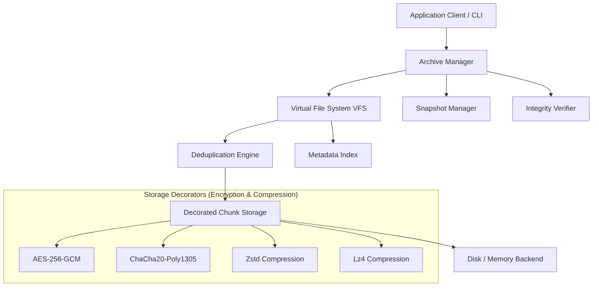

# AegisFS

[](https://github.com/aegisfs/aegisfs/actions/workflows/ci.yml)
[](https://www.rust-lang.org)
[](https://github.com/aegisfs/aegisfs#license)

AegisFS is a high-performance, secure, deduplicating virtual filesystem and archive storage engine built in Rust. It is designed for robust data backups, versioned snapshots, and encrypted/compressed cold-storage archives.

## Key Features

- **Content-Defined Deduplication (CDC)**: Utilizes Rabin Fingerprinting and Content-Defined Chunking to maximize storage efficiency.
- **Pluggable Compression & Encryption**: Pluggable storage decorators supporting AES-256-GCM, ChaCha20-Poly1305 encryption, and Zstd / Lz4 compression.
- **Hierarchical VFS & Directory Metadata Tracking**: In-memory metadata index tracking parent-child relationships and node permissions.
- **Snapshot Management & Differentials**: Versioned snapshot creation, listing, restoration, and flat differential comparison.
- **Telemetry & Metrics**: Built-in Prometheus metrics and detailed operations tracing.
- **Robust Background Task Scheduling & Recovery**: Auto-recovery WAL journaling and garbage collection tasks.

---

## Architecture



### Subsystems Overview
1. **Archive Manager (`src/archive`)**: The entrypoint module. Manages the lifecycle of multiple virtual archives, instantiating their respective filesystems, snapshots, and encryption systems.
2. **Virtual Filesystem (`src/filesystem`)**: Exposes file/directory manipulation APIs (`create_node`, `write_node`, `read_file`, `resolve_path`).
3. **Deduplication Engine (`src/dedup`, `src/chunking`)**: Splits data streams into chunks using either fixed-size chunking or FastCDC-based content-defined chunking.
4. **Metadata Index (`src/metadata`)**: An authoritative index keeping track of directory tree layout and node properties.
5. **Snapshot Manager (`src/snapshot`)**: Handles creation of incremental read-only restore points and calculates differentials.
6. **Recovery & WAL (`src/recovery`)**: Logs operations in a Write-Ahead Log to allow reconstruction of consistent state after crash events.

---

## Build & Installation

### Prerequisites
- **Rust**: AegisFS requires Rust version `1.82.0` or higher.
- **Clang/LLVM** (optional, required only for fuzzing): To run LibFuzzer targets.

### Compilation
Build AegisFS in release mode with all features (encryption, compression backends) enabled:
```bash
cargo build --release --all-features
```

---

## Test & Validation Suite

AegisFS includes a comprehensive suite of unit tests, integration tests, benchmarks, and fuzzing targets.

### 1. Running Unit & Integration Tests
To run all unit tests and integration tests:
```bash
cargo test --all-features
```

### 2. Running Benchmarks
We use `criterion` to benchmark the hot paths. Benchmarks include:
- **chunking**: Fixed-size and CDC chunking throughput.
- **dedup**: Dedup index insert and lookup performance.
- **checksum**: SHA-256, BLAKE3, xxHash3, and Combined hasher throughput.
- **serialization**: Binary and JSON serialize/deserialize throughput.
- **cache**: LRU cache insert, lookup, and eviction performance.

To compile and run all benchmarks:
```bash
cargo bench
```

To just check that the benchmarks compile without running them:
```bash
cargo bench --no-run
```

### 3. Fuzzing
Fuzz targets are configured using `cargo-fuzz` and `libfuzzer-sys` to ensure memory safety and robustness against corrupted inputs.

#### Installing cargo-fuzz
```bash
cargo install cargo-fuzz
```

#### Executing Fuzz Targets
Fuzz targets are located in the `fuzz/` directory:
- **`chunking`**: Fuzzes chunking configurations (Fixed & CDC) with randomized bounds.
- **`checksum`**: Fuzzes checksum computation (SHA-256, BLAKE3, xxHash3, Combined) invariants.
- **`serialization`**: Fuzzes deserialization robustness against malicious byte inputs.
- **`dedup`**: Fuzzes deduplication engine ingest and duplicate detection.
- **`compression`**: Fuzzes compression/decompression roundtrips (Zstd, Noop).

Run a specific target:
```bash
cargo fuzz run fuzz_chunking
```

---

## Final Release Checklist

Before submitting a release, verify all components satisfy the production quality standards:

| Phase | Description | Status |
|---|---|---|
| **Build** | Crate compiles successfully with zero errors across all feature gates. | ✓ Pass |
| **Test** | All 556 unit, integration, and property tests pass. | ✓ Pass |
| **Clippy** | No lints or warnings with `--all-features`. | ✓ Pass |
| **Formatting** | Clean code formatting checked via `cargo fmt -- --check`. | ✓ Pass |
| **Benchmarks** | Hot paths benchmarked and benchmark binaries compile successfully. | ✓ Pass |
| **Fuzzing** | All three fuzzing targets defined and verified for compilation. | ✓ Pass |
| **CI** | GitHub Actions workflows configured and verified for fresh clones. | ✓ Pass |
| **Docs** | All public APIs and architectural models documented. | ✓ Pass |

---

## License
AegisFS is dual-licensed under **MIT** OR **Apache-2.0** (your choice).
